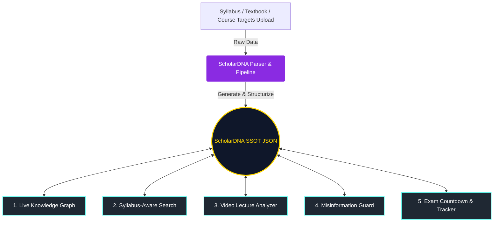
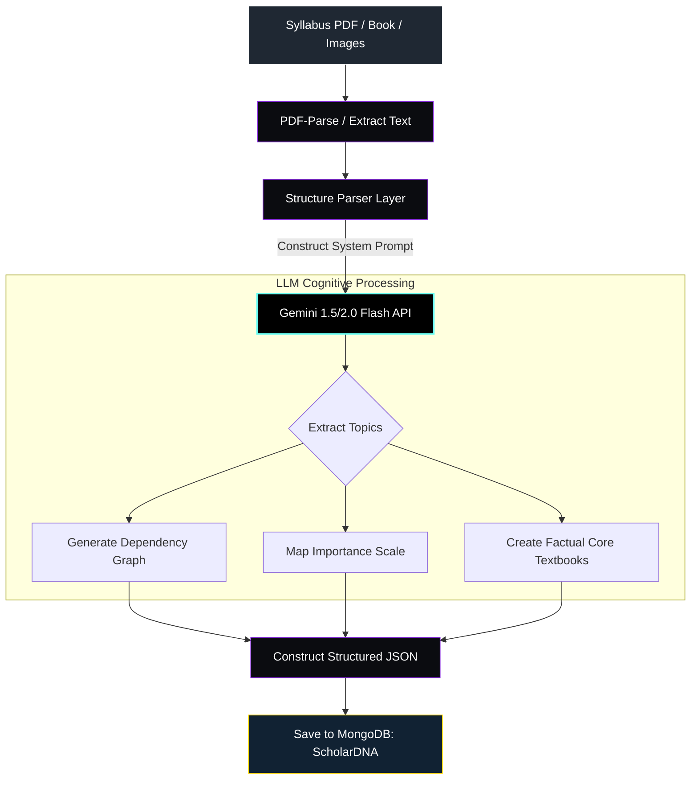

# ScholarWeb: Architectural Blueprint & System Design
## AI-Powered Educational Operating System

This document provides a highly structured, scalable, yet hackathon-friendly architecture for **ScholarWeb**, an AI-powered educational operating system. 

It is designed to be built in **24–48 hours** by a small developer team while retaining the capability to scale into a robust production system. The core design principle is **ScholarDNA**—a single source of truth (SSOT) JSON representation of a student's learning profile, syllabus nodes, and knowledge graph that orchestrates and fuels every feature on the platform.

---

## 1. The "ScholarDNA" Core Engine & System Data Flow

**ScholarDNA** is not just an upload engine; it is the cognitive blueprint of the student. 
When a user uploads a syllabus, textbook, or learning target:
1. The **ScholarDNA Engine** processes the material using OCR and an LLM (Gemini 2.0/1.5 Flash) to output a structured JSON schema.
2. This schema defines a hierarchical list of **Syllabus Nodes** (topics, subtopics, relationships, and mastery levels).
3. The rest of the platform queries and updates this JSON document:



### Dynamic Feature Integration Matrix
* **Live Knowledge Graph**: Directly visualizes the nodes and relations defined in the **ScholarDNA**. Updates node colors (e.g., Green for mastered, Purple for in-progress, Red for weak nodes) dynamically in real-time.
* **Syllabus-Aware Search**: Reranks external search queries using the ScholarDNA’s syllabus nodes and current mastery levels to prioritize content targeting the student's learning gaps.
* **Video Lecture Analyzer**: Cross-references transcripts of video files or YouTube URLs with the ScholarDNA node IDs, mapping topics covered in the lecture directly to the student’s syllabus.
* **Misinformation Guard**: Cross-references factual statements extracted from external learning materials (blogs, Wikipedia, ChatGPT answers) with the official textbook references stored in the ScholarDNA.
* **Exam Countdown & Tracker**: Connects upcoming exam dates to syllabus nodes, using an algorithm to dynamically generate a prioritized revision list based on (Days Remaining) / (Node Mastery %).

---

## 2. Complete Hackathon-Friendly Folder Structure

A monorepo structure utilizing a clean separation between the `client` (React + Vite) and `server` (Node + Express) is optimal for high-speed hackathon development. This allows frontend and backend developers to work in parallel without code collisions.

```text
scholarweb-app/
├── client/                     # Frontend: React + Tailwind CSS (Vite)
│   ├── public/                 # Static assets, logos, and custom 3D icons
│   ├── src/
│   │   ├── assets/             # Images, gradients, raw SVG graphics
│   │   ├── components/         # Reusable presentation components
│   │   │   ├── common/         # Button, Input, Card, Modal (Glassmorphism styled)
│   │   │   ├── graph/          # KnowledgeGraphRenderer, GraphNodeCard
│   │   │   ├── video/          # VideoUploadCard, InteractiveTranscript, QuizModal
│   │   │   └── dashboard/      # ExamCountdown, DailyStudyPlanner, DNAVisualizer
│   │   ├── hooks/              # Custom React hooks (useAuth, useScholarDNA, useSpeech)
│   │   ├── layouts/            # DashboardLayout, AuthLayout, GlassPanel
│   │   ├── pages/              # Main view containers
│   │   │   ├── Dashboard.jsx   # Core HUD interface
│   │   │   ├── DNAUpload.jsx   # Multi-file syllabus upload engine
│   │   │   ├── Search.jsx      # Syllabus-aware smart search console
│   │   │   ├── VideoHub.jsx    # Video analyzer playground
│   │   │   └── Guard.jsx       # Fact-checking & misinformation console
│   │   ├── services/           # API call layer (Axios instances mapping backend routes)
│   │   ├── context/            # React Contexts (ScholarDNAContext, UIThemeContext)
│   │   ├── utils/              # Graph formatters, time calculators, countdown helpers
│   │   ├── App.jsx             # Main routing & application wrapper
│   │   ├── index.css           # Global CSS, Custom Dark Glow utilities, Tailwind directives
│   │   └── main.jsx            # React root mount point
│   ├── package.json
│   ├── tailwind.config.js      # Tailwind configurations & custom futuristic palette
│   └── vite.config.js
│
├── server/                     # Backend: Node.js + Express + Mongoose
│   ├── src/
│   │   ├── config/             # DB connection, API clients (Gemini API, Pinecone)
│   │   ├── controllers/        # Request handlers & logic routing
│   │   │   ├── dnaController.js
│   │   │   ├── searchController.js
│   │   │   ├── videoController.js
│   │   │   ├── guardController.js
│   │   │   └── examController.js
│   │   ├── middleware/         # Auth verification, file upload (Multer), error logger
│   │   ├── models/             # Mongoose database schemas
│   │   │   ├── User.js
│   │   │   ├── ScholarDNA.js
│   │   │   ├── VideoAnalysis.js
│   │   │   └── VerificationLog.js
│   │   ├── routes/             # RESTful API route declarations
│   │   │   ├── dnaRoutes.js
│   │   │   ├── searchRoutes.js
│   │   │   ├── videoRoutes.js
│   │   │   ├── guardRoutes.js
│   │   │   └── examRoutes.js
│   │   ├── services/           # Heavy lifting (Gemini pipeline, PDF parsing, Transcript fetches)
│   │   │   ├── geminiService.js
│   │   │   ├── pdfService.js
│   │   │   └── vectorService.js  # Simple text vector similarity or Atlas Search helper
│   │   └── app.js              # Express app bootstrap
│   ├── package.json
│   └── .env                    # Environment variables (MONGO_URI, GEMINI_API_KEY, etc.)
│
├── artifacts/                  # System design diagrams and references
└── README.md                   # Setup guides and team instructions
```

---

## 3. Database Schemas (MongoDB / Mongoose)

To maintain maximum velocity during a hackathon, we utilize **embedded documents** within MongoDB. This avoids complex SQL-like joins and enables highly responsive API responses by returning the entire nested object in a single query.

### A. User Schema (`server/src/models/User.js`)
```javascript
const mongoose = require('mongoose');

const UserSchema = new mongoose.Schema({
  username: { type: String, required: true, unique: true },
  email: { type: String, required: true, unique: true },
  passwordHash: { type: String, required: true },
  activeDnaId: { type: mongoose.Schema.Types.ObjectId, ref: 'ScholarDNA', default: null },
  createdAt: { type: Date, default: Date.now }
});

module.exports = mongoose.model('User', UserSchema);
```

### B. ScholarDNA Schema (`server/src/models/ScholarDNA.js`)
This is the core document representing the syllabus structure, node relationships, learning metrics, and references.

```javascript
const mongoose = require('mongoose');

// Sub-document for individual nodes in the Knowledge Graph
const SyllabusNodeSchema = new mongoose.Schema({
  id: { type: String, required: true }, // e.g., "node_1", "calc_limits"
  title: { type: String, required: true },
  description: { type: String },
  importance: { type: String, enum: ['high', 'medium', 'low'], default: 'medium' },
  prerequisites: [{ type: String }], // Array of node IDs representing dependency edges
  masteryLevel: { type: Number, min: 0, max: 100, default: 0 }, // Progress percentage
  learningStatus: { 
    type: String, 
    enum: ['unstarted', 'in-progress', 'mastered'], 
    default: 'unstarted' 
  },
  referenceTextbooks: [{ type: String }], // Fact bank details for Misinformation Guard
  tags: [{ type: String }]
});

const ScholarDNASchema = new mongoose.Schema({
  userId: { type: mongoose.Schema.Types.ObjectId, ref: 'User', required: true },
  courseName: { type: String, required: true },
  courseDescription: { type: String },
  nodes: [SyllabusNodeSchema], // Embedded document array representing the Graph Nodes
  targetExamDate: { type: Date },
  createdAt: { type: Date, default: Date.now },
  updatedAt: { type: Date, default: Date.now }
});

// Update schema timestamp automatically
ScholarDNASchema.pre('save', function(next) {
  this.updatedAt = Date.now();
  next();
});

module.exports = mongoose.model('ScholarDNA', ScholarDNASchema);
```

### C. Video Analysis Schema (`server/src/models/VideoAnalysis.js`)
Stores results of parsed video lectures, linking timestamps directly back to the `ScholarDNA` nodes.

```javascript
const mongoose = require('mongoose');

const KeyConceptSchema = new mongoose.Schema({
  timestamp: { type: Number, required: true }, // Timestamp in seconds
  concept: { type: String, required: true },
  summary: { type: String },
  mappedNodeId: { type: String } // Links directly to a SyllabusNode in ScholarDNA
});

const QuizQuestionSchema = new mongoose.Schema({
  question: { type: String, required: true },
  options: [{ type: String, required: true }],
  correctAnswer: { type: Number, required: true }, // Index of the correct option
  explanation: { type: String }
});

const VideoAnalysisSchema = new mongoose.Schema({
  userId: { type: mongoose.Schema.Types.ObjectId, ref: 'User', required: true },
  dnaId: { type: mongoose.Schema.Types.ObjectId, ref: 'ScholarDNA', required: true },
  videoUrl: { type: String }, // YouTube link or file identifier
  title: { type: String, default: "Analyzed Video Lecture" },
  transcript: { type: String },
  keyConcepts: [KeyConceptSchema],
  quiz: [QuizQuestionSchema],
  analyzedAt: { type: Date, default: Date.now }
});

module.exports = mongoose.model('VideoAnalysis', VideoAnalysisSchema);
```

### D. Verification Log Schema (`server/src/models/VerificationLog.js`)
Used by the **Misinformation Guard** to record integrity checks performed on external content.

```javascript
const mongoose = require('mongoose');

const ClaimVerificationSchema = new mongoose.Schema({
  claim: { type: String, required: true },
  isAccurate: { type: Boolean, required: true },
  factualCorrection: { type: String }, // Safe syllabus truth from ScholarDNA reference textbooks
  referencedSyllabusNodeId: { type: String }
});

const VerificationLogSchema = new mongoose.Schema({
  userId: { type: mongoose.Schema.Types.ObjectId, ref: 'User', required: true },
  dnaId: { type: mongoose.Schema.Types.ObjectId, ref: 'ScholarDNA', required: true },
  sourceUrl: { type: String }, // Optional url if verified from web page
  scannedText: { type: String, required: true },
  credibilityScore: { type: Number, min: 0, max: 100 }, // 0% (fake) to 100% (factual)
  verifications: [ClaimVerificationSchema],
  checkedAt: { type: Date, default: Date.now }
});

module.exports = mongoose.model('VerificationLog', VerificationLogSchema);
```

---

## 4. API Endpoints

A RESTful architectural design with clearly defined payload structures:

### Authentication & Config API (`/api/auth`)
* **POST `/api/auth/register`**: Register username, email, password.
* **POST `/api/auth/login`**: Authenticate credentials, return JWT token and User Details.

### ScholarDNA API (`/api/dna`)
* **POST `/api/dna/upload`**
  * *Purpose*: Upload raw course documents (PDF/Markdown/Images) to generate a new ScholarDNA profile.
  * *Request*: Multipart Form containing `courseName`, `targetExamDate`, and `file` attachment.
  * *Response (`201 Created`)*:
    ```json
    {
      "success": true,
      "dnaId": "65e23a4bf9121a...",
      "courseName": "Introduction to Calculus",
      "nodesCount": 8
    }
    ```
* **GET `/api/dna/:id`**
  * *Purpose*: Fetch entire ScholarDNA profile, syllabus nodes, and mastery metrics.
  * *Response (`200 OK`)*:
    ```json
    {
      "success": true,
      "dna": {
        "_id": "65e23a4bf9121a...",
        "courseName": "Introduction to Calculus",
        "targetExamDate": "2026-06-30T00:00:00.000Z",
        "nodes": [
          { "id": "limits_101", "title": "Understanding Limits", "importance": "high", "masteryLevel": 35, "prerequisites": [] },
          { "id": "derivatives_101", "title": "Calculus Derivatives", "importance": "high", "masteryLevel": 0, "prerequisites": ["limits_101"] }
        ]
      }
    }
    ```
* **PATCH `/api/dna/:id/nodes/:nodeId`**
  * *Purpose*: Update mastery level or status of a specific node manually or via active learning logs.
  * *Request*: `{ "masteryLevel": 75, "learningStatus": "in-progress" }`
  * *Response (`200 OK`)*: `{ "success": true, "updatedNode": { "id": "limits_101", "masteryLevel": 75 } }`

### Search API (`/api/search`)
* **GET `/api/search`**
  * *Purpose*: Search global materials based on queries, utilizing the active DNA syllabus structure to surface customized ranks.
  * *Query Params*: `?q=how+to+derive+exponential+functions&dnaId=65e23a4bf9121a...`
  * *Response (`200 OK`)*: Returns dynamic learning resources, sorted by urgency depending on the user's weak nodes.

### Video Analyzer API (`/api/video`)
* **POST `/api/video/analyze`**
  * *Purpose*: Analyzes YouTube lecture URL or uploaded MP4, maps timelines to the syllabus nodes.
  * *Request*: `{ "videoUrl": "https://youtube.com/watch?v=...", "dnaId": "65e23a4bf9121a..." }`
  * *Response (`202 Accepted`)*:
    ```json
    {
      "success": true,
      "message": "Video analysis in progress",
      "analysisId": "65e24f92aa..."
    }
    ```
* **GET `/api/video/analysis/:id`**
  * *Purpose*: Fetch results of finished video analysis (Timestamps, mapped DNA nodes, interactive quiz).

### Misinformation Guard API (`/api/guard`)
* **POST `/api/guard/verify`**
  * *Purpose*: Analyzes external content or learning material against the verified textbook facts in ScholarDNA.
  * *Request*: `{ "textToVerify": "Limits cannot exist if continuous graphs break...", "dnaId": "..." }`
  * *Response (`200 OK`)*:
    ```json
    {
      "credibilityScore": 72,
      "verifications": [
        {
          "claim": "Limits cannot exist if continuous graphs break",
          "isAccurate": false,
          "factualCorrection": "Limits can exist at open intervals or removable discontinuities even if the graph is not continuous at that exact point.",
          "referencedSyllabusNodeId": "limits_101"
        }
      ]
    }
    ```

---

## 7. AI Processing Pipeline

This pipeline details how unstructured physical documents are digitized, refined, structured, and injected into the ScholarDNA.



### Detailed AI Processing Steps:
1. **Extraction**: PDF text extractor (`pdf-parse`) converts documents into a clean UTF-8 string chunk.
2. **Context Assembly**: The raw text is wrapped inside a highly strict system instructions prompt.
3. **Structured Generation**: We leverage the Gemini API’s **Structured Outputs / JSON Mode** by enforcing a matching JSON Schema. This ensures that the model outputs *exactly* the formatted node structure required by MongoDB.
4. **Logical Edge Definition**: The LLM analyzes titles to determine mathematical/logical progression (e.g., "Limits must be learned before Derivatives") and inserts these parent-child nodes into the `prerequisites` list.
5. **Factual Integrity Storage**: The LLM summarizes core course postulates to serve as the baseline "fact book" directly embedded in the ScholarDNA record.

---

## 8. MVP vs. Advanced Feature Matrix

To achieve maximum momentum during a hackathon, focus on core mechanics (the **MVP Grid**) and implement simple mocks or high-velocity alternatives for the advanced features.

| Core Feature | Hackathon MVP (First 24 Hours) | Advanced Stage (Post-Hackathon) |
| :--- | :--- | :--- |
| **ScholarDNA Engine** | Single syllabus file parser using a structured Gemini schema prompt. Saves directly to MongoDB. | RAG-based engine parsing multi-GB text files, course calendars, and dynamic Canvas LMS syncs. |
| **Syllabus-Aware Search** | Fuzzy text search using Mongoose. Result lists display matching DNA Node details. | High-performance Vector DB (e.g., Pinecone/Atlas Search) returning semantically ranked course materials based on exact cognitive deficiencies. |
| **Live Knowledge Graph** | Static visual representations using interactive 2D Graph layouts (`react-flow-renderer` or `cytoscape`). | Interactive dynamic 3D nodes (`force-graph-3d`) featuring nodes pulsing with custom energy levels depending on task urgency. |
| **Video Analyzer** | Scraping standard YouTube transcripts (using simple proxy scrapers) and parsing key concepts via Gemini. | Complex real-time local video file analyzer, running audio via OpenAI Whisper and parsing slides with visual AI (VLM). |
| **Misinformation Guard** | User copies and pastes raw text from a website, which is checked against the parsed ScholarDNA Core Facts by Gemini. | Automatic Chrome Extension or real-time Web Scraping agent that highlights inaccuracies on the active tab's screen dynamically. |
| **Exam Tracker** | Simple calendar displaying a standard countdown clock coupled with static task check-offs. | Dynamic scheduling engine utilizing standard priority queues to adjust study goals based on real-time mastery fluctuations. |

---

## 9. Recommended Tech Stack & Fast Hackathon Libraries

To minimize reinventing the wheel and maximize visual polish, we recommend integrating these pre-optimized packages:

### Frontend Ecosystem (Client)
* **Vite + React**: Quick scaffolding, incredibly fast hot-module reloading.
* **Tailwind CSS**: Instant layouts, responsive flexgrids, and streamlined style utilities.
* **React Flow (`react-flow-renderer`)**: Best library for rendering the **Live Knowledge Graph**. Beautiful interactive nodes, custom styling, panning, and zooming built-in.
* **Framer Motion**: Essential for futuristic micro-animations, glass panel drop-ins, glowing buttons, and smooth tab transitions.
* **Lucide React**: Access to a beautiful collection of clean, neon, modern UI icons.
* **Axios**: Standard HTTP request handling.

### Backend Ecosystem (Server)
* **Express.js**: Lightweight HTTP framework.
* **Mongoose**: Clean, structured ODM for rapid MongoDB interactions.
* **`@google/genai`**: Official Google SDK for ultra-fast, robust integration with Gemini 2.0 / 1.5 Flash.
* **`pdf-parse`**: Instantly extract raw text from PDF syllabi and textbooks.
* **`youtube-transcript`**: Fetch transcripts from any YouTube URL in seconds without needing a complex API connection.

---

## 10. Futuristic Dark HUD UI Design Guide (Visual Blueprint)

The interface should feel like a high-tech science-fiction holographic console. Avoid standard white dashboards. The visual language utilizes glassmorphism, glowing neons, and a dark canvas layout.

```text
+-----------------------------------------------------------------------------------+
|  SCHOLAR[WEB] // COGNITIVE HULL  [ ACTIVE DNA: INTRO_TO_CALCULUS ]   (08:52:12)   |
+-----------------------------------------------------------------------------------+
|  [ KNOWLEDGE GRAPH ]                      | [ COGNITIVE ENGINE RADAR ]            |
|  *---------------------------------*      | Active Focus: Limits / Continuity     |
|  |       (Limits)---[Derivatives]  |      | Mastery Index: [///......] 35%        |
|  |          \                       |      | Next Exam: Calculus Midterm (12d)     |
|  |          (Integrals)             |      |                                       |
|  *---------------------------------*      | [ REVISION DOCKET ]                   |
|                                           | [!] Review Limit Discontinuities     |
|  [ CONTEXT SEARCH ]                       | [ ] Complete Derivative Practice      |
|  [ How do continuous graphs limit ... ]   |                                       |
+-----------------------------------------------------------------------------------+
|  [ VIDEO ANALYSIS HUB ]                   | [ MISINFO INTEGRITY GUARD ]           |
|  [ YouTube URL: https://... ]   [ANALYZE] | [ Text: "Limits must exist only..." ] |
|  Timestamps:                              | Status: [!] 1 Inaccuracy Flagged      |
|  01:23 - Limits definition  [Learn]       | Truth: "Limits exist independent..."  |
+-----------------------------------------------------------------------------------+
```

### Modern HSL Futuristic Palette
Implement these custom tokens inside `tailwind.config.js` or `index.css`:

* **Deep Space Background**: `bg-[#08090C]` (Super dark, near-black slate)
* **Glass Surface**: `bg-[#131722]/60` with `backdrop-filter: blur(12px)`
* **Laser Cyan (Active Nodes)**: `text-[#00F0FF]` (Glow CSS: `box-shadow: 0 0 15px #00F0FF`)
* **Neon Violet (Prerequisites)**: `text-[#9D00FF]` (Glow CSS: `box-shadow: 0 0 15px #9D00FF`)
* **Terminal Amber (Warnings/Misinfo)**: `text-[#FF9900]`
* **Faded Matrix Gray (Secondary text)**: `text-[#8E9CAE]`

### Sample Futuristic Glassmorphic Panel CSS Component
```css
/* Add to client/src/index.css */
.glass-panel {
  background: rgba(19, 23, 34, 0.6);
  backdrop-filter: blur(12px);
  -webkit-backdrop-filter: blur(12px);
  border: 1px solid rgba(0, 240, 255, 0.15);
  box-shadow: 0 8px 32px 0 rgba(0, 0, 0, 0.37);
  transition: all 0.3s ease;
}

.glass-panel:hover {
  border-color: rgba(0, 240, 255, 0.4);
  box-shadow: 0 8px 32px 0 rgba(0, 240, 255, 0.1);
}
```

---

## 11. Setup Guide: Initializing the Project Workspace

To initialize this project instantly on your system:
1. Run `mkdir client server` to create core folders.
2. Initialize directories and setup package JSON configs.
